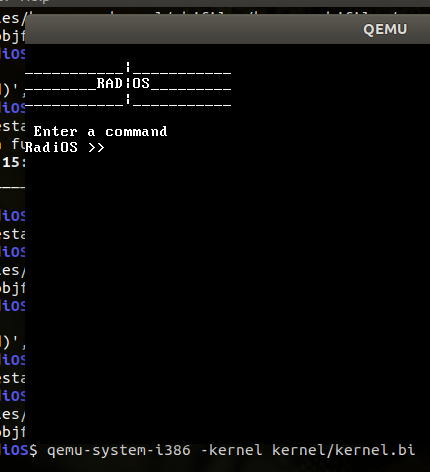

# RadiOS [incomplete]
Radios is a very primitive nano ~~Operating System~~ written for educational purposes.

## Screenshot



## Getting Started

To get the project up and running on your local machine for development and testing purposes

```
run build.sh
```
For end user to test the program:
```
install disk_images/radios.iso in virtualbox
```

### Prerequisites

What things you need to install the software and how to install them

```
1. For building iso image: roxxiso
2. For creating bootloader: grub 
3. Compile C code: gcc
4. Compile assembly code: nasm
5. Test Kernel without making iso: qemu

```

### Installing

```
1. nasm -f elf32 kernel/source/kernel.asm -o kernel/objfiles/kerasm.o
2. gcc -m32 -c kernel/source/kernel.c -o kernel/objfiles/kerc.o -ffreestanding
3. gcc -m32 -c includes/system.c -o objfiles/system.o -ffreestanding 
4. gcc -m32 -c includes/string.c -o objfiles/string.o -ffreestanding 
5. gcc -m32 -c includes/keyboard.c -o objfiles/keyboard.o -ffreestanding 
6. gcc -m32 -c includes/screen.c -o objfiles/screen.o -ffreestanding 
7. ld -m elf_i386 -T linker/link.ld -o kernel/kernel.bin kernel/objfiles/kerasm.o kernel/objfiles/kerc.o objfiles/system.o objfiles/string.o objfiles/screen.o objfiles/keyboard.o
8. qemu-system-i386 -kernel kernel/kernel.bin
9. grub-mkrescue -o disk_images/radios.iso kernel/kernel.bin
```


## Built With

* [x86 Assembly](https://en.wikipedia.org/wiki/X86_assembly_language) - starting point for kernel
* [C Programming Language](https://en.wikipedia.org/wiki/C_(programming_language)) - everything else

## Author

* **Sagar Dhungel** - [Journal](https://sagardhungel.com.np/about) - [email](mailto:mail@sagardhungel.com.np)

## ToDos
uff.

## License

This project is licensed under the MIT License - see the [LICENSE](https://opensource.org/licenses/MIT) file for details

## Acknowledgments

* https://www.cs.bham.ac.uk/~exr/lectures/opsys/10_11/lectures/os-dev.pdf
* https://samypesse.gitbooks.io/how-to-create-an-operating-system/
* etc

